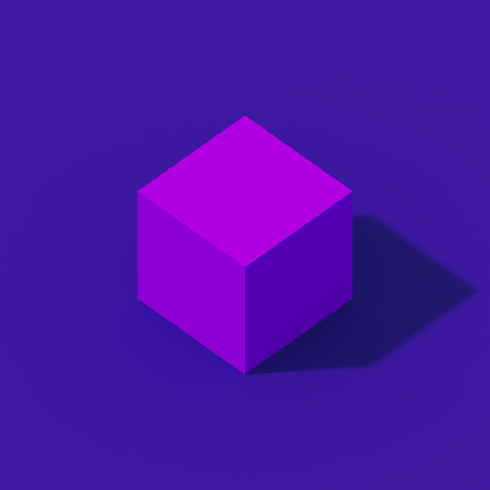

# Geometry-Dash-3D

Geometry Dash 3D in three.js

## Chats

[Telegram](https://t.me/joinchat/mp4IqfyDpxI2NDIy)
[Discord](https://discord.gg/MygWFdByEk)

## Install

1. Clone repository with `git clone https://github.com/Korovskaya-Enterteiment/Geometry-Dash-3D.git`

1. Install dependencies with `yarn install`

1. Run app localy with `yarn start`

Now you have your game running! 🎉
